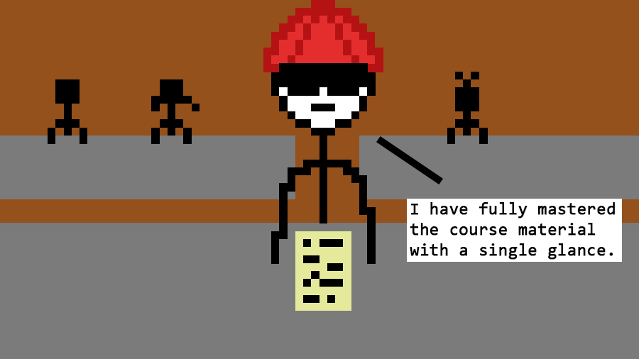

Let me start this off by saying that, like all of us, I can be pretty lazy at times. It's the lazy kind of feeling you have when wake up at noon, then stay in bed until 5 looking at memes, despite saying you'll wake up at 6am last night. But there's still work to be done and tasks to complete, so I have to find ways to motivate myself to complete these tasks.


Despite all of this, my academic results and excellence reflect someone who studies diligently and pulls all-nighters and wakes up at 5am every day to study. I ended this last fall semester of college with A+'s across the board with honestly less effort than I thought I would have needed to put in. A reason for this is because, out of my laziness, I ensure that all the time I spend learning the material is spent as efficiently as possible. I have watched a lot of my friends sink into habits that make them learn material at a slower pace when they could be making the most of their study hours, so I'm here to share of my personal studying and test taking tips to help you stuff the most knowledge into your brain and get the best possible mark on your tests.

# Study Tips

### Employ active recall

Meet my friend Rolando. He's never been super great in school, but he attends every lecture. He tries to succeed, but he just never does. He studies with his other friends, but they do well on the exams even when he doesn't.

See, Rolando feels like he's learning the material, but when he's trying to solve problems without anyone else's help, it's just not working out. That's because Rolando's **not actually learning the material**. He's just tricking himself into thinking he is. Here are some other things Rolando does:

- Mindlessly reading through his lecture notes saying "Seems simple enough"
- Checking his phone for 5 minutes during the lecture then asking if the professor covered "anything important" in the last little bit
- Not understanding something during the lecture and saying "Oh well, I'll learn it for the final"
- Wears sunglasses indoors. Not cool, Rolando.



See, what Rolando is doing here is called **passive recall**, which is where you're not really sure if you're learning or not. What you should really be doing is **[active recall](https://en.wikipedia.org/wiki/Active_recall)**, where you're interacting with the course material and actively stimulating your memory while you study. Here, your brain actually has an active problem to solve and try to come up with solutions for. This does two things:

1. You get a good idea of what you know/don't know
2. The information will stick in your head better, since your brain has actively worked with the new concepts

This is why flash cards work so great when you're learning a new language, or memorizing terms for an exam. When you see that term on the test, your brain can access that information much quicker and easier since that's exactly what it's been trying to do over the course of your entire study session.

What a lot of people don't know, including Rolando, is that you can **apply active recall to every aspect of learning**. That's right, when you're skimming through your textbook, you can turn that into an active learning experience by quickly quizzing yourself on what you just learned. When you're sitting in your lecture, and the professor is doing practice examples, you can try doing it yourself using your own notes before comparing with the professor. When you're writing notes down in class, you can write down your own notes in your own words rather than copying down the notes exactly how the professor says it (this can be especially helpful if your professor doesn't have very good notes).

### Use visualization

One of the most interesting things my Grade 10 math teacher was, in fact, not related to math at all. During one of our Friday classes, he presented himself a challenge: The class would give him 30 words to memorize, and in 5 minutes, he would have them all memorized by heart. Now, being the little smartpants we were, we gave our teacher some extremely challenging words, like _piezoelectric_ and _blasphemous_, as well as some seemingly forgettable words, like _tree_. I mean, try it yourself - it's definitely a lot harder than it sounds. We were certain this guy had no way of doing it.

But after the 5 minutes was up, he recalled each and every word, not only in sequence, but if you asked for the 20th word,he'd be able to give it almost immediately. Conversely, if you gave him one of the given words, he'd be able to tell you where that word was in the sequence. It was some real black magic, and he had the attention of every naive tenth-grader in the class.

Then, a week later, he revealed his secret to us. For every word, he had a system of mapping the numbers to words. For example, he mapped the number 12 to red (this was easier to remember, since you could say that the number 12 looks like an R when written out, which is what red starts with). Then, let's say the 12th word given was _water_. The secret to it was to **visualize** a scene in your head that related the words red and water, and make it vivid as possible.

Imagine turning on the sink, and instead of water, blood flows out! You can feel the stress as the sink starts to overflow with blood, and you can feel the stickyness of the red liquid as you desperately try to stop the flow of the blood. Now, when you think of red, you can immediately think of the PTSD-inducing scenario you just conjured up. This is a lot easier and more natural to remember than to try to remember that the number 12 maps to _water_.


You can use this with any concept or detail you find yourself struggling to memorize. Here are some examples:

- You want to remember that magnetic field lines always point to north. Well, instead of thinking about field lines, think about Santa Claus and his reindeer. When they go home, they travel back to the North Pole. Now when you think of field lines, just think of Santa Claus, and you'll immediately remember where they point to.
- You're learning C++, and you want to know when to use the `<<` and `>>` operators when using `cin` and `cout`. Instead of trying to remember them as fact, try to visualize the flow of data through your program. Consider this code:
  ```
  cout << b;
  ```
  Imagine the data from the `b` variable shooting out of the arrows and into the `cout` object and out into the vast unknown of the universe, and it'll make a whole lot more sense.

However, visualization in itself is a skill that you can practice and improve, so you might not be able to do it right away. You can start off with drawing little doodles on the side of your notes in order to strengthen the connection in your brain. Improving this skill can also help when you're trying to visualize problems on tests, which is useful for Physics type problems. Try to apply this visualization principle to concepts or details that you find yourself having a hard time memorizing, and I'm sure you'll have an easier time recalling it the next time you need it.

### Maximize your resources

Another thing that you should do is **identify the method you learn the course material best**. Note that this can be different with each course, depending on the resources available for the course material. If you can't learn from the professor, find a different source of information, whether that be a YouTube video, or notes from a different class, or even just the textbook the course is based on. What you're doing here is maximizing the knowledge you gain, since you're learning from the method that you learn from the best.

Now, if you're attending lectures, you want to make sure that you're keeping on top of the lecture material. After every class, you should have a good idea of what you didn't immediately understand. You should make sure you have a very solid understand of the concepts and examples that were presented within the lecture **before the next lecture starts**. If you don't there's a good chance you get lost during the next lecture, which sets you even further behind, and you end up learning less from the lecture than you possibly could have. Now that's not making the most out of your studying time.

### Exercise

This is less of a study tip and more of an overall life tip: try to exercise at least a little bit a day. If you want to study as efficiently as possible, you want to be a hyper-efficient learning machine where your brain is a sponge that soaks up everything you throw at it. Exercise will help you get closer to this ideal state - you'll be less stressed and anxious, and find yourself more alert and focused when trying to learn the information. Plus, it'll make you more tired and willing to go to sleep at the night, so it'll also encourage you to have good sleeping habits.

# Testing Tips

Now that you've gained some insight into better ways to study, you should now hopefully feel a little more comfortable going into tests. However, that doesn't mean that you'll run into a question that you just have no idea how to solve. I've also compiled a few tips to help you when you feel stuck.

### The test is your friend

The test actually gives you a lot of information you might not realize. One tip that I find useful is looking specifically at what kind of wrong answers the test maker might throw in to throw off students. Then, from patterns in the answers, you can use this to make a solid guess on what the answer might be. For example, you might find that a question has a step where a common mistake is to forget to divide by 2. Suppose of the four choices are `1.50`, `2.00` `3.00` and `5.00`. You can notice that `1.50` is `3.00` divided by 2, so `1.50` is a good guess for an answer if you don't know how to approach the question. Furthermore, if you are looking over your exam and you see a pattern like this, you should try to brainstorm a common mistake you may have forgotten to factor in that made you choose an incorrect answer. 

If a test comes with a formula sheet, they do that for a reason. Many questions that you might not know how to do could present you with some numbers and variables that you can simply plug into a formula and hope that one of the answers is on there. Throw in the above tip to help you see if there are any other tricks that you may need to look out for.

### Skip it and save it for later

This is probably an obvious point, but I often find myself forgetting this tip and end up spending way too much time on a single question. But really, if you're stuck on a question, it's only one mark. It's better to skip it than to let yourself devolve into a bigger ball of stress than you already are. In addition, some of the later questions might even give you some information or some hints on how to solve the question you were stuck on.

Note that everyone learns and absorbs information in their own way, so one or more of these tips may not work best for you. Feel free to hit me up through [LinkedIn](https://www.linkedin.com/in/jofred-cayabyab/) or via [email](mailto:jofred.cayabyab1@ucalgary.ca) if there's anything you want to share with me or if you have any tips of your own. Otherwise, I hope these tips help you study better and give you time to watch that Netflix series you haven't been able to keep up with!

**P.S.:** If all else fails, you can put on some round wireframe glasses. Even if you're not doing that well academically, you'll look and feel smart, and that's really all that matters in the end. The glasses will also help gazing into the mirror at your sorry self and motivating you to change your lazy and self-destructive ways.

