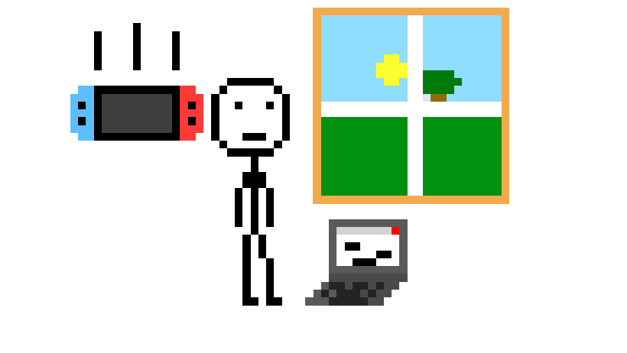
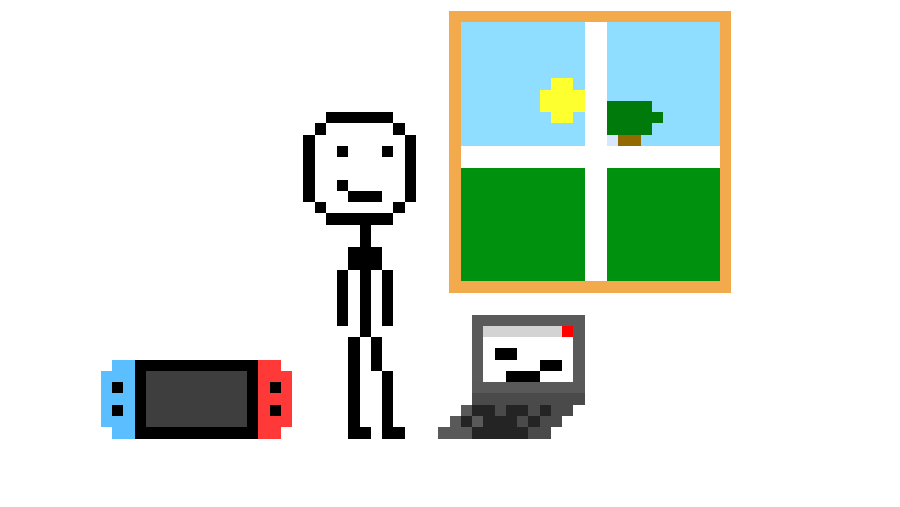
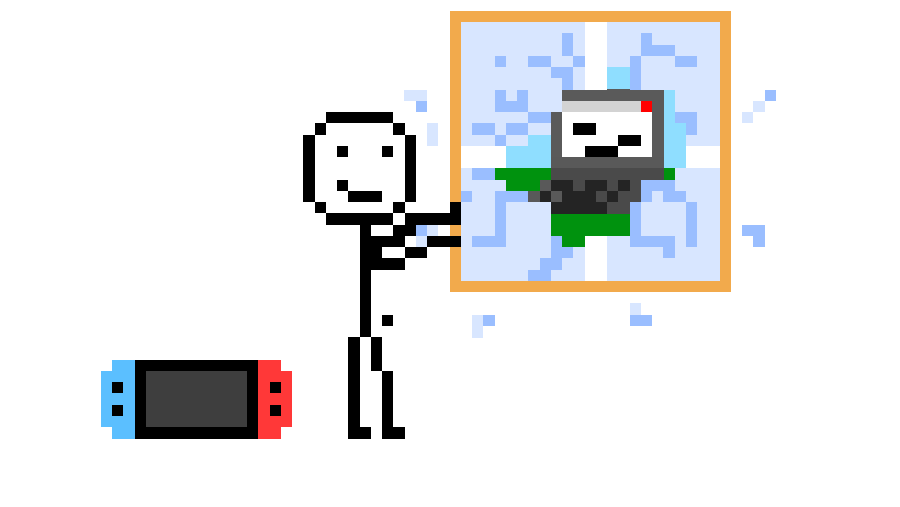

Hey! Thanks for the taking the time to look through my site and my blog. I'm a excited to get some content up on this thing - I have a lot of ideas for future interesting blog posts. But, before I do any of that, here's a little introduction.

My name is Jofred Cayabyab, but I've been called **Jay Jay** as a nickname basically all my life. According to my parents, when I was but a young lad, I really liked a show called [Jay Jay the Jet Plane](https://en.wikipedia.org/wiki/Jay_Jay_the_Jet_Plane) enough to start calling myself Jay Jay, and I guess the name has just stuck since then. Ironically enough, I actually have no recollection whatsoever of the show itself; the only real cartoons I remember watching when I was really young were The Berenstain Bears and Max & Ruby. But if you know me by one name and get confused when you hear me get called the other, now you know why.

When my engineering degree isn't taking up all of my free time, here are some things I like to do:

- Build things! (Just like this site and some of the side projects I've worked on so far.)
- Play and watch basketball. The team I'm currently rooting for is any team that can beat the Warriors, but right now I'm a big fan of the Celtics.
- Sing and listen to music. I like a little bit of everything, but I'm mostly into R&B and hip-hop. My favourite artists are Frank Ocean and Daniel Caesar. Here's a playlist I made that's pretty much my go-to listen right now:

<iframe src="https://open.spotify.com/embed/user/12181081327/playlist/65IpiSkJMjoSLbB52oHZo9" width="300" height="380" frameborder="0" allowtransparency="true" allow="encrypted-media"></iframe>

- Play video games. I just bought a Nintendo Switch, so my plans of being productive over the winter break have pretty much been tossed out the window. Here's a quick illustration of what happened once my Switch shipped:

As an aside, a lifelong goal of mine has been to create and develop my own video game one day. I'm also treating this blog as a way to practice some skills that would help me in this pursuit, like writing and pixel art. I'm going to try to include some [Wait But Why](https://waitbutwhy.com/)-esque illustrations in pixel art form on future blog posts.

Hopefully that serves as a fair introduction to this blog! Hope you come back to read some of my future blog posts, where I try to be funny, but not try too hard to the point where you wouldn't want to be my friend. Until next time!
